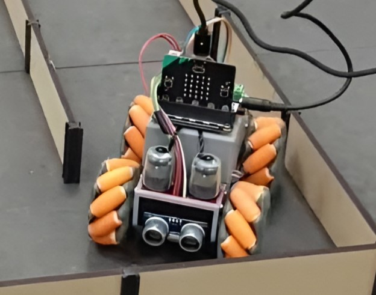

# Hardware

## Car
The mecanum car chassis is fully custom and 3D-printed and as provided by our course instructor Richard.

It uses the DFR0548 motor driver and breakout board to control the motors and connect sensors to the Micro:bit.

## Sensor setup
As our car is too long to rotate in place we can only turn when starting the turn early. Thus we need to be able to drive both forward and backwards. In fact the front and back are identical and inside the code the 180 degrees turn is really just inverting what is forward and backwards on settings motors and sensor values.

We have one HC-SR04 ultrasonic distance sensor in front and one in the back.

On the side IR emitter / diodes are used to try to read a meaningful distance vlaue at a much higher rate than the ultrasonic sensors can provide.
