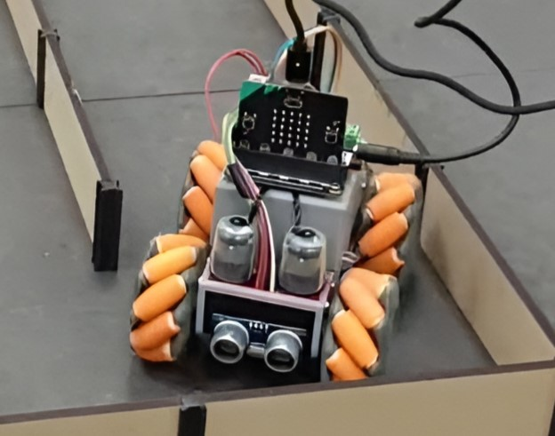

# MicroBros

## Introduction
MicroBros is a project and group focused on creating a Micromouse to compete within the Smart Systems course at USN Kongsberg.

Our main focus is the software stack we are building.

## Getting started
- To get started hacking on MicroBros one needs to setup the [Development environment](Docs/DevelopmentEnvironment.md).
- For information about the hardware, check out [Hardware](Docs/Hardware.md).
- An overview of the overall project architecture can be found at [Architecture](Docs/Architecture.md).
